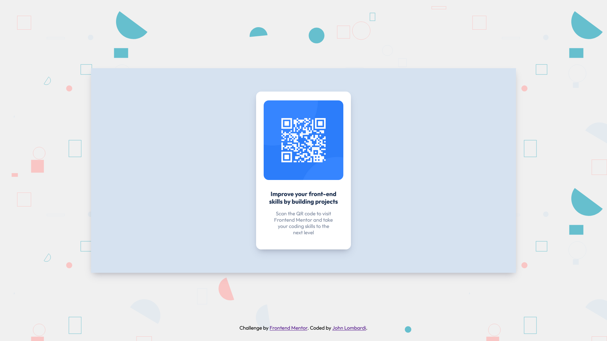

# QR Code Component



## Table of contents

- [Overview](#overview)
  - [Links](#links)
- [My process](#my-process)
  - [Tools](#tools)
  - [What I learned](#what-i-learned)
- [Author](#author)
- [Credits](#credits)

## Overview

This project aims to build a QR code component that matches a given design as closely as possible. It was built using html and sass, along with git for version control. This is my solution to the QR code component challenge on Frontend Mentor.

### Links

- Live Site URL: [QR Code Component](https://johnlombardi389.github.io/qr-code-component/)

## My process

### Tools

- HTML5
- CSS / SASS
- Flexbox
- Visual Studio Code
- Git

### What I learned

- Learning how to use Sass to write more maintainable and scalable CSS code
- Using Sass variables
- Apply my skills in HTML, CSS, and Sass, to help become more proficient as a web developer

Example from the project:

```css
$dark_blue: hsl(218, 44%, 22%);
$title_size: 1.2rem;
```

```css
h1 {
  font-weight: 700;
  font-size: $title_size;
  color: $dark_blue;
}
```

## Author

John Lombardi

- [Portfolio](https://johnlombardi389.github.io/portfolio/)
- [LinkedIn](https://www.linkedin.com/in/johnlombardi389/)
- [GitHub](https://github.com/johnlombardi389)
- [Frontend Mentor](https://www.frontendmentor.io/profile/johnlombardi389)

## Credits

- QR Code from [Frontend Mentor](https://www.frontendmentor.io/challenges/qr-code-component-iux_sIO_H)
- SVG Background from [BGJar](https://bgjar.com/%22%3EBGJar)
